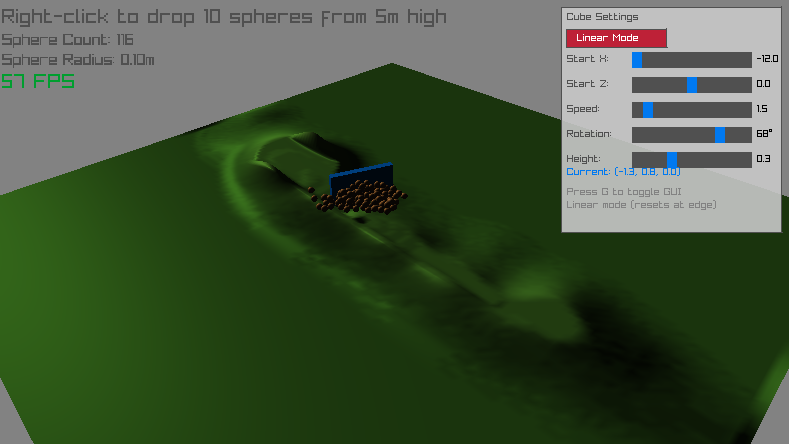

# RayRay - Physics Terrain Simulation

A real-time physics simulation demo built with [raylib](https://www.raylib.com/) and [Jolt Physics](https://github.com/jrouwe/JoltPhysics).



## Features

- **Dynamic Heightmap Terrain**: Procedurally generated terrain using Perlin noise
- **Physics-Based Terrain Deformation**: A moving cube digs into the terrain and displaces material
- **Particle System**: Displaced terrain spawns physics-simulated spheres that settle and convert back to terrain
- **Cellular Automata**: Density-based simulation for realistic material flow and settling
- **Real-time Lighting**: Directional lighting with ambient and specular components
- **Interactive GUI**: Control cube movement, rotation, height, and movement modes
- **Orbital Camera**: Mouse-controlled camera for viewing the simulation from any angle

## Controls

| Input | Action |
|-------|--------|
| **Left Mouse Button** | Rotate camera |
| **Mouse Wheel** | Zoom in/out |
| **Right Click** | Drop 10 spheres at clicked terrain point |
| **G** | Toggle GUI panel |

## GUI Settings

The simulation includes two movement modes:

### Linear Mode
- **Start X/Z**: Starting position for the cube
- **Speed**: Movement speed
- **Rotation**: Blade angle (0-90°)
- **Height**: Cube height offset

### Circle Mode
- **Center X/Z**: Center of circular path
- **Radius**: Circle radius
- **Speed**: Angular speed
- **Rotation**: Blade angle relative to tangent
- **Height**: Cube height offset

## Building

### Requirements
- CMake 3.10+
- C++17 compatible compiler
- Git (for fetching dependencies)

### Build Instructions

```bash
# Configure
cmake -B build

# Build
cmake --build build --config Debug
```

### Dependencies (automatically fetched)
- [raylib 5.5](https://github.com/raysan5/raylib) - Graphics and windowing
- [Jolt Physics v5.2.0](https://github.com/jrouwe/JoltPhysics) - Physics simulation

## Project Structure

```
rayray/
├── main.cpp              # Main application source
├── CMakeLists.txt        # Build configuration
├── README.md             # This file
├── img/                  # Screenshots
│   └── image.png
├── shaders/              # GLSL shaders
│   ├── directional_light.vs/fs
│   ├── heightmap.vs/fs
│   └── blob.vs/fs
└── build/                # Build output (generated)
```

## Technical Details

- **Heightmap Resolution**: 256x256
- **Terrain Size**: 20x20 world units
- **Physics Update**: 60 Hz
- **Max Spheres**: 200 (auto-converts to terrain when limit reached)
- **Sphere Settling**: Spheres convert to terrain after 0.5s of being stationary

## License

This project uses open-source dependencies. See individual library licenses:
- raylib: [zlib License](https://github.com/raysan5/raylib/blob/master/LICENSE)
- Jolt Physics: [MIT License](https://github.com/jrouwe/JoltPhysics/blob/master/LICENSE)
